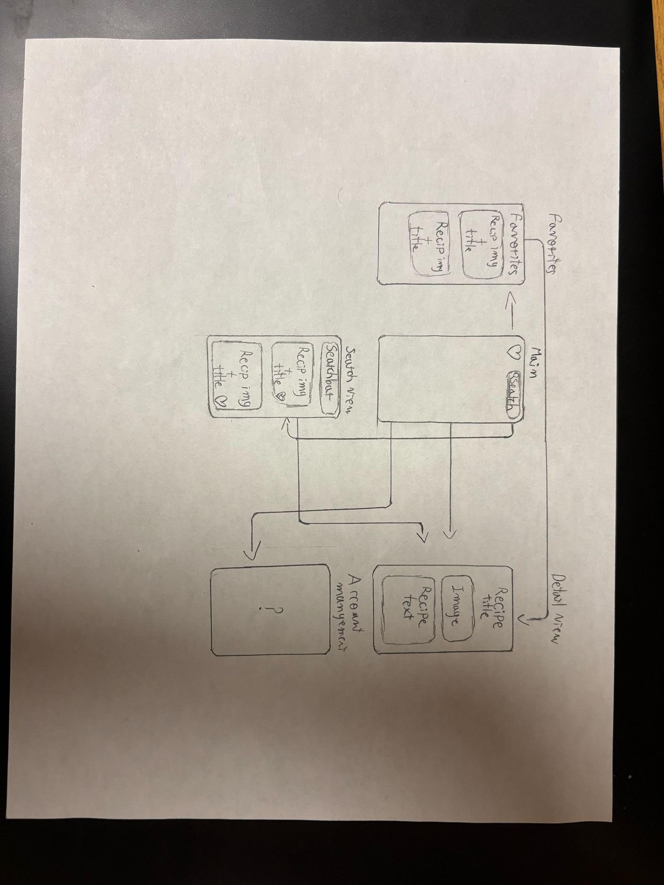

# Forkly

## Table of Contents

1. [Overview](#overview)
2. [Product Spec](#product-spec)
3. [Wireframes](#wireframes)
4. [Milestone GIFs](#milestone-gifs)
5. [Schema](#schema)

## Overview

### Description

Forkly is an iOS application that leverages the Spoonacular API to enable users to search for recipes, view cooking instructions, and save favorite dishes locally. Built using Swift and SwiftUI, the app demonstrates integration with external APIs, data persistence, and clean UI practices.

Our team began development in a shared repo using milestone-based planning. Midway through, we encountered architectural challenges and UI limitations that constrained our ability to move forward efficiently. After evaluating our options, we made a strategic decision to rewrite the app in a cleaner, more maintainable codebase. This allowed us to improve the core features while continuing to follow our original roadmap, ultimately delivering a more stable and user-focused final product.

### 🔁 Project Evolution

This repository represents the evolved version of our original app [Original Repo](https://github.com/COP4655-Group3/RecipeApp). The original repo contains early milestone planning and initial development. After identifying scalability and UI flow limitations, we transitioned to this new repo to refine and expand the app. Milestones here reflect continuation and improvement of the original goals.

#### Milestone Continuity

| Original Repo Milestone       | Status in New Repo              |
|------------------------------|----------------------------------|
| Recipe Search Functionality   | ✅ Re-implemented & improved      |
| Recipe Detail View            | ✅ Refined with better formatting |
| Save to Favorites             | ✅ Now includes persistent local storage |
| UI Layout                     | ✅ Rebuilt using SwiftUI best practices |

### App Evaluation

- **Category:** Food & Drink  
- **Mobile:** Mobile only  
- **Story:** Our app is the guide that answers that question: "What should I cook tonight?" It offers inspiration, options based on taste or time, and something new to try — like a digital cookbook that never stops growing.  
- **Market:** Targeted at people who enjoy cooking or baking, including beginners who want structured guidance.  
- **Habit:** Designed for daily or weekly use as part of mealtime planning.  
- **Scope:** Broad coverage of recipes by type, yet focused in functionality (search, view, save).

---

## Product Spec

### 1. User Stories (Required and Optional)

#### **Required Must-have Stories**

For our app, we identified the following "must-have" features essential to a minimum viable product:

- **Search for Recipes**  
  *As a user, I want to search for recipes based on a keyword (e.g., “chicken”, “pasta”) so that I can find meals I want to cook.*

- **View Recipe Details**  
  *As a user, I want to tap on a recipe and view all the details (image, summary, instructions) so I know how to make it.*

- **Save and Access Favorite Recipes**  
  *As a user, I want to save recipes to a favorites list and view them later so I don’t lose the meals I liked.*

Additional MVP functionality:
- User can search for a new recipe
- User can see multiple recipes and select the specific one they want
- User can view a clean, step-by-step breakdown of the recipe
- User can favorite recipes and access them across app sessions

#### **Optional Nice-to-have Stories**

- **Filter recipes by dietary preference**
- **Add ingredients to a shopping list**
- **Allow users to create their own recipes**
- User login for personalized experience
- Filtering based on cuisine, diet, or cooking time
- Cloud-synced favorites via backend

---

### 2. Screen Archetypes

- **Home Screen**  
  Entry point for accessing search and viewing favorited recipes.

- **Search Screen**  
  - User can search for new recipes  
  - User can browse and select from results  
  - Recipes display image and title

- **Recipe Details Screen**  
  - User can view a detailed breakdown of the selected recipe  
  - Includes image, summary, instructions

- **Favorite Recipes Screen**  
  - User can see all previously saved recipes  
  - Tapping a recipe shows its details again  
  - Data persists across app sessions

---

### 3. Navigation

#### **Tab Navigation**
- Home Screen
- Recipe Search Screen
- Recipe Detail View Screen
- Favorites Screen

#### **Flow Navigation**

- **Home Screen**
  - Leads to Search Screen

- **Search Screen**
  - Leads to Recipe Detail Screen

- **Recipe Detail Screen**
  - Can save to favorites
  - Leads to Favorites Screen

- **Favorites Screen**
  - Taps lead back to Recipe Detail Screen

---

## Wireframes



### [BONUS] Digital Wireframes & Mockups

_(Add digital versions if available)_

---

## Milestone 1 GIF

<div>
  <a href="https://www.loom.com/share/73016fdd0f2047fe934aac0b0504d881">
    <p>Loom | Milestone 1 Demo</p>
  </a>
  <a href="https://www.loom.com/share/73016fdd0f2047fe934aac0b0504d881">
    
  </a>
</div>

---

## Schema

### Models

| Property  | Type   | Description                                |
|-----------|--------|--------------------------------------------|
| id        | Int    | Unique recipe ID                           |
| title     | String | Title of the recipe                        |
| image     | String | URL or asset name of the recipe image      |
| summary   | String | Short summary or description (HTML parsed) |
| instructions | String | Step-by-step instructions (HTML parsed) |

---

## Networking

**Endpoints Used (Spoonacular API)**

- `[GET] /recipes/complexSearch` — search for recipes by keyword  
- `[GET] /recipes/{id}/information` — fetch detailed recipe info

_Example:_
```swift
https://api.spoonacular.com/recipes/complexSearch?query=pasta&apiKey=YOUR_API_KEY
